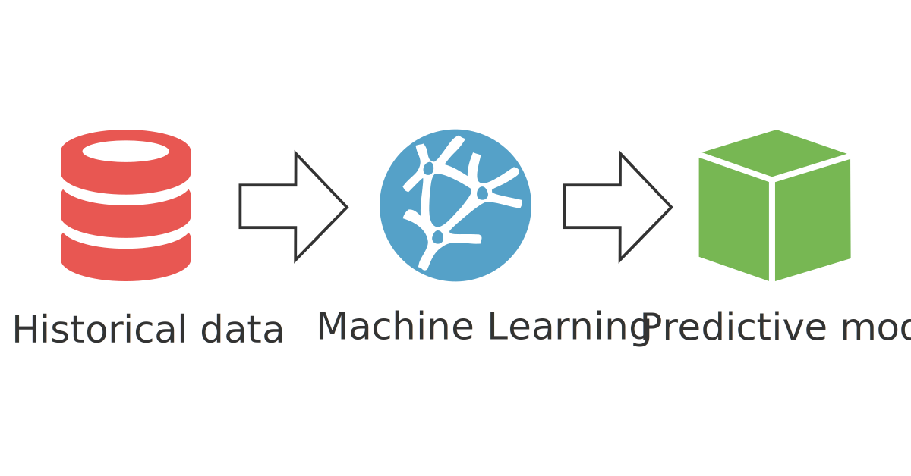

# Applied Machine Learning Project #

## Good User Prediction ##
The goal of this project is to apply Machine Learning concepts, frameworks, and infrastructure to solve the problem of predicting whether or not a user on a community Q&A website will eventually become a "good" user based on their first 10 posts/comments/responses.

The metric used to determine a "good'" user may vary depending on the website. For example, karma for Reddit or number of responses on StackOverflow that were selected as the "accepted" response. This problem has the potential to yield interesting results and has **clear business implications**.

##  Overview  ##
The project is broken up into 7 steps. My intent here is not so much to present an impressive product as it is to document my learning experience and give readers insight into my problem solving approach.

 - **Import the Data** 
 - **Clean the Data**  
 - **Split the Data into Training/Test Sets**   
 - **Create a Model**   
 - **Train the Model**   
 - **Make Predictions**   
 - **Evaluate and Improve**   

## Tools / Languages / Libraries 
 - Python (tbd)
 - Juptyer Notebook (tbd)
 - Numpy (tbd)
 - Scikit-learn (tbd)
 - Pandas (tbd)
 - Matplotlib (tbd)
 - Tableau (tbd)
 - Reddit API (tbd)

### Import the Data ###
-----

Document process

### Clean the Data ### 
---
Document process
### Split the Data into Training/Test Sets ###
---
Document process
### Create a Model ###
---
Document process
### Train the Model ###
---
Document process
### Make Predictions ###
---
Document process
### Evaluate and Improve ###
---
Document process